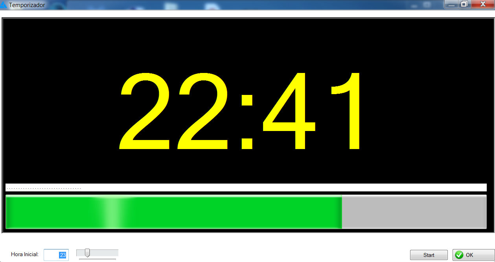

<h1 align="center">
    
</h1>

Temporizador para windows feito em Clarion
    
Timer for windows made in Clarion

📌 Temporizador 
------------------
O projeto foi feito com clarion.

The project was done with clarion.

🔧 Tecnologias utilizadas:
------------------

- CLARION 

💬 Fale comigo
------------------
[*Entre em contato comigo*](https://www.linkedin.com/in/ivo-baptista-3712144/)

Obrigado aos meus amigos Mark Sarson, <a href="https://www.linkedin.com/in/roberto-renz-327a3622/">Roberto Renz</a>, <a href="https://github.com/MarkGoldberg"> Mark Goldberg </a>, Fred J. Pedraza,  José Ignacio Blasco (Tito), Ramon Pacheco, Ricardo Pardo e Pedro Priori por me ajudar a sempre esclarecer minhas dúvidas e manter o Clarion vivo

Thanks to my friends Mark Sarson,<a href="https://github.com/robirenz">Roberto Renz</a>, <a href="https://github.com/MarkGoldberg">Mark Goldberg</a> , Fred J. Pedraza, Jose Ignacio Blasco (Tito), Ramon Pacheco, Ricardo Pardo and Pedro Priori for helping me to always clarify my doubts and keep Clarion alive

